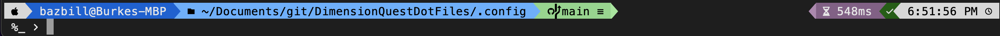
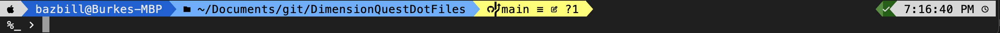

# Theme Name: holoconsole

This theme is inspired by the powerlevel10k-rainbow theme.

I've stored a copy of my theme here: [.config/ohmyposh/holoconsole.omp.json](../.config/ohmyposh/holoconsole.omp.json)

## Prompt installation

The guidance below assumes you already have [oh-my-posh](https://ohmyposh.dev/docs) and a supported prompt already installed. Personally, I use the [Meslo Nerd Font](https://www.nerdfonts.com/font-downloads).

**HINT:** ```oh-my-posh font install meslo

If you wish to use the prompt configuration I have here, simply copy the .config/ohmyposh/holoconsole.omp.json to your home directory under the .config/ohmyposh folder. Then update your .zshrc / .bashrc with the following as the last line:

```bash
# For zsh
eval "$(oh-my-posh init zsh --config ~/.config/ohmyposh/holoconsole.omp.json)"
```

```bash
# For bash
eval "$(oh-my-posh init bash --config ~/.config/ohmyposh/holoconsole.omp.json)"
```

```powershell
# For powershell
oh-my-posh init pwsh --config ~/.config/ohmyposh/holoconsole.omp.json | Invoke-Expression
```

Please read on below to see some examples of the features implemented in this font configuration.

# Holoconsole preview





# Features
## Line 1
### Left

This theme is configured to use a transient prompt so that you screen does not fill up with all the colorful prompt every time you hit enter. It also activates certain segments on the left/right of the terminal window.

- OS - Session "User@Host - Folder" - [Git status]

### Right
- Execution time - [Python] - [Azure] - [GCP] - [AWS] - [ArgoCD] - [Terraform] - [Kubectl] - [Helm] - [Docker] - last command status - time

## Line 2
- [Root indicator] - shell (pwsh/zsh/bash/sh/cmd) - Right Chevron >