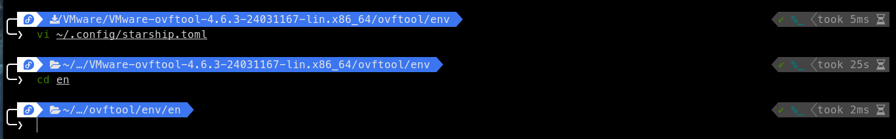
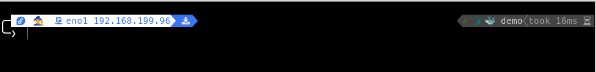

# Prompt installation

If you wish to use the prompt configuration I have here, simply copy the starship.toml to your home directory under the .config folder.

Please read on below to see some examples of the features implemented in this font configuration.

# directory -  example



## truncation_length
Rather than displaying every directory back to root or home, you can easily truncate the path. The screenshot above illustrates the effect of changing my truncation_length from 8 to 3:

As you can see, prior to the change, the prompt path took up over half the width of my window! Truncation helps keep your screen a bit less cluttered.

The code required in the starship.toml to have this take effect is:

```toml
[directory]
disabled = false
format = '[ $path ]($style)[$read_only]($read_only_style)'
style = 'fg:#E4E4E4 bg:#3B76F0'
truncation_symbol = " ~/…/"
truncation_length = 3 
```

##  .substitutions

An additional feature on display is the use of substituions. In particular, you can see in the screenshot that rather than displaying the full path to my Downloads folder (/home/bazbill/Downloads), the  icon is displayed instead. You can specify any number of substitutions you wish. If you don't get the results you expect, try adjusting the order of items in your directory.substitutions values.

```toml
[directory.substitutions]
"~/Downloads" = ""
#"~/Music" = ""
#"~/Pictures" = " "
#"~/Videos" = ""
#"~/Projects" = "󱌢"
#"~/School" = "󰑴"
#"~/GitHub" = ""
"~/.config" = ""
"~" = ""
```

## os - symbols

The TOML section below is what I have set for this prompt. Note: if you don't see the icon/glyph for a specific entry, this simply means you don't have the necessary nerd font loaded in your browser, editor, terminal.

```toml
[os]
format = "[$symbol]($style)"
style = "fg:prim bg:sec"
disabled = false

[os.symbols]
Alpine = ""
Amazon = ""
Android = ""
Arch = ""
CentOS = ""
Debian = ""
DragonFly = "🐉" # ""
Emscripten = "🔗"
EndeavourOS = ""
Fedora = ""
FreeBSD = ""
Garuda = ""
Gentoo = ""
HardenedBSD = "聯"
Illumos = "🐦"
Linux = ""
Macos = ""
Manjaro = ""
Mariner = ""
MidnightBSD = "🌘"
Mint = ""
NetBSD = ""
NixOS = ""
OpenBSD = "" 
OpenCloudOS = "☁️"
openEuler = ""
openSUSE = ""
OracleLinux = "⊂⊃"
Pop = "" # ""
Raspbian = ""
Redhat = ""
RedHatEnterprise = ""
Redox = "🧪"
Solus = ""
SUSE = ""
Ubuntu = ""
Unknown = ""
Windows = ""
```

## Interface and IP display, sudo indicator

This screenshot shows the effects of setting enable on my custom.interface and local ip. We can see in the screenshot that my local interface is en01!

Additionally, note the little wizard icon to the right of my Fedora logo, that shows that sudo still has cached credentials.

Over on the right, we can see that I have a Dockerfile in my current directory as shown by the 🐳 icon and I am in the "demo" docker context. My shell shows as bash (Note the icon in the shell section below) and my last command took 16ms to complete.



Here are the TOML snippets that make that all happen:

### interface, localip, sudo

Note: Depending on which OS you are running, you will need to comment/uncomment the "command" line. In my case, I am running Linux, so I have the Linux command line uncommented in order to grab my interface name.

```toml
[custom]
[custom.interface]
format = " $symbol $output"
description = "testing"
symbol = '󰩠'
when = true
# command = "route get default | grep interface | awk '{print $2}'" # MacOS
command = "ip route get 1 | awk '{print $5}'" # Linux
# command = "netstat -rn | grep default | awk '{print $6}'" # BSD
disabled = false

[localip]
ssh_only = false
format = ' $localipv4'
disabled = false

[sudo]
format = '$symbol'
symbol = ' 🧙'
disabled = false
```

### shell, docker, command duration

```toml
[shell]
disabled = false
powershell_indicator = ' '
pwsh_indicator = ' '
bash_indicator = ' '
zsh_indicator = '%_ '
cmd_indicator = ' '
unknown_indicator = ' '
style = 'cyan bold bg:#444444'
format = '[$indicator]($style)'

[docker_context]
format = '[$symbol$context]($style)'
style = 'bg:#444444'
symbol = '🐳 '
disabled = false
only_with_files = true
detect_files = [
  'docker-compose.yml',
  'docker-compose.yaml',
  'compose.yaml',
  'compose.yml',
  'Dockerfile',
]

[cmd_duration]
format = "[](fg:#7a7a7a bg:#444444)[took $duration  ]($style)"
style = "fg:#9b9b9b bg:#444444"
min_time = 1
disabled = false
```