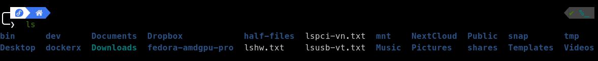
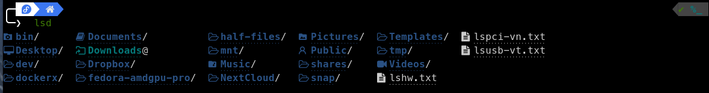
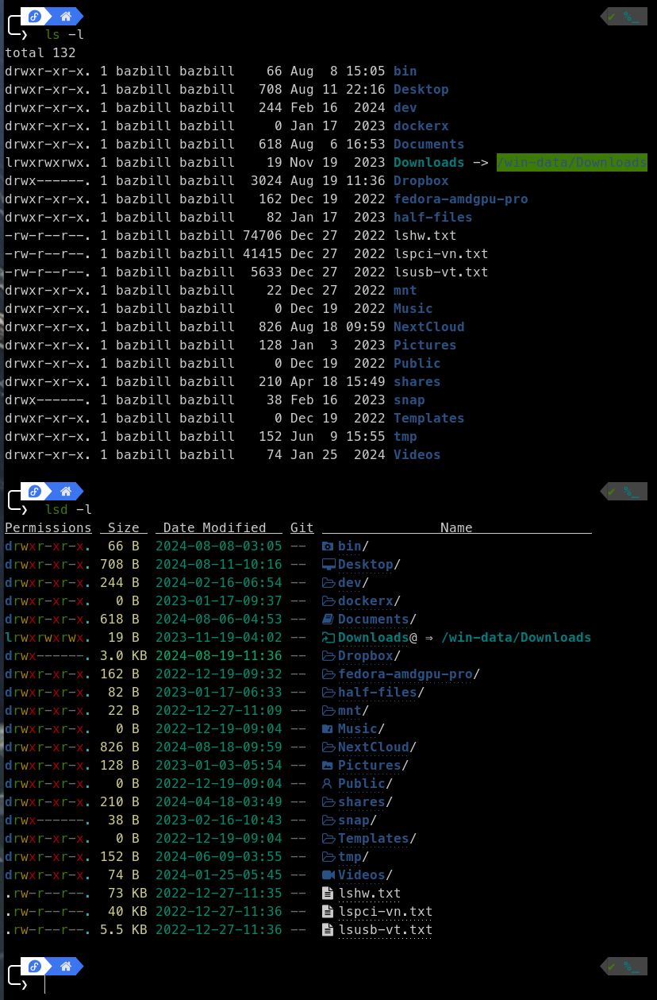

# My LSD Configuration preferences

I've stored a copy of my personal settings under .config/lsd/config.yml

## Notable changes I have made
blocks: 
The long-list: I have disabled user and group from the listing. This is because nothing shows under those columns when used on Windows. It's simply a matter of uncommenting those in the "blocks:" section of the yml to get them showing on Linux/MacOS. I also added "git".

Date: I've reformatted the date to be four digit year - two digit month - two digit day

total-size: I set this to false. While this may sound nice, it increases the time for a simple lsd call when a parent or child directory has many GB of data that must be added up.

header: I set this to true just because I like it.

## Screenshots
Here's what a standard ls looks like on my Fedora 40 workstation:

And here's lsd:

Here are the differences between the long list (-l):

